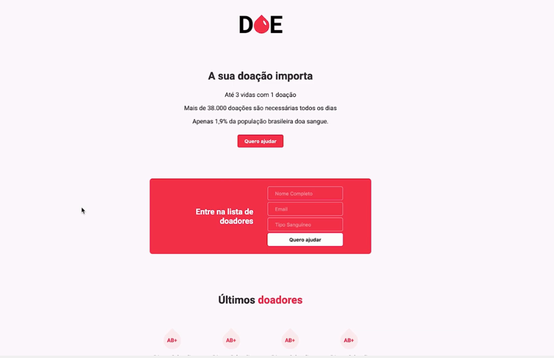

<h1 align="center">
  DOE
</h1>

## 📋 Índice

- [Preview](#-Preview)
- [Sobre](#-Sobre)
- [Tecnologias utilizadas](#-Tecnologias-utilizadas)
- [Como executar o projeto](#-Como-executar-o-projeto)

---

## 🖥 Preview

  

---

## 📖 Sobre 

O DOE é um site feito para cadastro de doadores de sangue, foi desenvolvido durante a Maratona Dev 3.0 da Rocketseat com o professor Mayk Brito. Durante a semana participamos do desenvolvimento completo da página web. Para o frontend foi utilizado HTML e CSS e para o backend foi utilizado o Node.js com o Postgres no banco de dados.

---

## 🚀 Tecnologias utilizadas
O projeto está sendo desenvolvido com as seguintes tecnologias:
- HTML5
- CSS3
- Javascript
- Node.js
- Postgres

---

## ⌨ Como executar o projeto

(Em Desenvolvimento)

---
